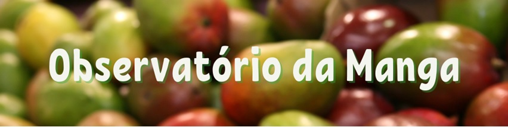

```{r setup, include=FALSE}
knitr::opts_chunk$set(
  echo       = FALSE,
  warning    = FALSE,
  message    = FALSE,
  comment    = NA,
  fig.width  = 10,
  fig.height = 6,
  fig.align  = "center",
  comment    = "#",
  size       = "normalsize"
  )

library(lubridate)
anterior <- as.Date("2022-08-01")
atual <-  as.Date("2022-09-01")

#Linhas precisam de ajuste semanal: 30, 104, 201, 204
```

<br>

# ANÁLISE DOS EMPREGOS GERADOS NA MANGICULTURA EM `r toupper(strftime(atual, format = "%B DE %Y"))`

<br>

Os dados utilizados nesta análise são mensais e disponibilizados pelo CAGED (Cadastro Geral de Empregados e Desempregados) até o mês de `r strftime(atual, format = "%B de %Y")`. As variáveis são saldo de empregos, empregos por gênero, contratados por idade e por escolaridade para a cultura da manga. Considera-se o conjunto de municípios da Bahia (Casa Nova, Curaçá, Juazeiro, Sento Sé, Sobradinho, etc. ) e Pernambuco (Belém do S. Francisco, Lagoa Grande, Orocó, Petrolina, etc. ) que formam o Vale do Submédio São Francisco.

O saldo de empregos na mangicultura em `r strftime(atual, format = "%B de %Y")` no Vale do São Francisco foi de 449 pessoas, ou seja, o total de contratações (1.361) foi maior do que o total de demissões (912). Em relação ao mesmo mês do ano passado, se tem uma forte redução no saldo total (828 em 2021 e 449 em 2022). Nos nove meses do ano, são 2.019 empregos líquidos a menos do que no mesmo período de 2021. 

Dos contratados no mês, 837 são do sexo masculino e 524 do sexo feminino. Em relação à idade, aproximadamente a metade se concentra abaixo dos 30 anos: 246 até 21 anos, 223 até 24 anos, 175 até 27 anos e 116 até 30 anos. 

Sobre o nivel de escolaridade, a maioria das admissões é de pessoas com ensino médio completo (582). Do total de contratados, 42,76% possuem este nível de escolaridade. Este grau de estudo junto com 6 ao 9 ano do ensino fundamental (231) e médio incompleto (292) representam a grande parte dos contratados na mangicultura no Vale do São Francisco em `r strftime(atual, format = "%B de %Y")`. 

<br>

```{r tratamento_base}
#Direcionado o R para o Diretorio a ser trabalhado
setwd('/Users/jricardofl/Dropbox/tempecon/dados_caged')

#Inicio do Script
#Pacotes a serem utilizados 
library(ggplot2)
library(scales)
library(plotly)
library(dplyr)
library(DT)
library(tidyverse)

#Entrando dados no R
dados1 <- read.csv2('setembro_2022.csv', header=T, sep=";", dec = ".")
colnames(dados1)[1] <- 'date'
dados1$date <- seq(as.Date('2021-01-01'),to=atual,by='1 month')
dados1a <- dados1 
dados1a$ano <- strftime(dados1a$date, format="%Y") 
dados1a$mes <- strftime(dados1a$date, format="%B") 

saldo_21 <- dados1a %>% filter(ano=='2021')

saldo_21 <- saldo_21 %>%
  select(c(ano, mes, Saldo_Manga))

saldo_22 <- dados1a %>% filter(ano=='2022')

saldo_22 <- saldo_22 %>%
  select(c(ano, mes, Saldo_Manga))

saldom <- rbind(saldo_21, saldo_22)
saldom$mes <- factor(saldom$mes,levels = c("Janeiro", "Fevereiro", "Março", "Abril", "Maio", 
                                           "Junho", "Julho", "Agosto", "Setembro", "Outubro",
                                           "Novembro", "Dezembro"))

total_21 <- dados1a %>%
  select(c(ano, mes, Contratados_Manga, Demitidos_Manga, Saldo_Manga)) %>% 
  filter(ano=='2021')

total_21$mes <- factor(total_21$mes,levels = c("Janeiro", "Fevereiro", "Março", "Abril", "Maio", 
                                           "Junho", "Julho", "Agosto", "Setembro", "Outubro",
                                           "Novembro", "Dezembro"))

total_22 <- dados1a %>%
  select(c(ano, mes, Contratados_Manga, Demitidos_Manga, Saldo_Manga))%>% 
  filter(ano=='2022')

total_22$mes <- factor(total_22$mes,levels = c("Janeiro", "Fevereiro", "Março", "Abril", "Maio", 
                                           "Junho", "Julho", "Agosto", "Setembro", "Outubro",
                                           "Novembro", "Dezembro"))

totalm <- merge(total_21, total_22, by="mes", all = T)

totalm <- totalm %>%
  select(c(mes, Contratados_Manga.x, Demitidos_Manga.x, Contratados_Manga.y, Demitidos_Manga.y, Saldo_Manga.x, Saldo_Manga.y))

totalm <- totalm %>%
  rename("Contratados 2021" = Contratados_Manga.x,
         "Demitidos 2021" = Demitidos_Manga.x,
         "Contratados 2022" = Contratados_Manga.y,
         "Demitidos 2022" = Demitidos_Manga.y,
         "Saldo 2021" = Saldo_Manga.x,
         "Saldo 2022" = Saldo_Manga.y)


#Entrando com o restante dos dados

load("setembro_22_caged.RData")

#dados_06_vsf$sexo <- lapply(dados_06_vsf$sexo, factor)

dados_09_vsf$sexo[dados_09_vsf$sexo == 1] <- 0
dados_09_vsf$sexo[dados_09_vsf$sexo == 3] <- 1

dados_09_vsf <- mutate(dados_09_vsf,
                sexo = factor(sexo, levels = 0:1, labels = c("Masculino", "Feminino")))

# Mantendo apenas 

#Separando as admissoes e as demissoes
dados_09_vsf_positivos <-dados_09_vsf%>% filter(saldo_movim=="1")
dados_09_vsf_negativos <-dados_09_vsf%>% filter(saldo_movim=="-1")

#Mantendo apenas o agronegocio
secao_positivos <-dados_09_vsf_positivos%>% filter(secao=="A")
secao_negativos <-dados_09_vsf_negativos%>% filter(secao=="A")

#Mantendo apenas a manga
subclasse_positivos <-dados_09_vsf_positivos%>% filter(subclasse=="133410")
subclasse_negativos <-dados_09_vsf_negativos%>% filter(subclasse=="133410")

#Ajustando o grau de escolaridade
subclasse_positivos$grau_instrucao[subclasse_positivos$grau_instrucao == 80] <- 12
subclasse_positivos$grau_instrucao[subclasse_positivos$grau_instrucao == 99] <- 13

subclasse_positivos <- mutate(subclasse_positivos,
                grau_instrucao = factor(grau_instrucao, levels = 1:13, 
                                        labels = c("Analfabeto",
                                                   "Até 5ª Incompleto",
                                                   "5ª Completo Fundamental",
                                                   "6ª a 9ª Fundamental",
                                                   "Fundamental Completo",
                                                   "Médio Incompleto",
                                                   "Médio Completo",
                                                   "Superior Incompleto",
                                                   "Superior Completo",
                                                   "Mestrado",
                                                   "Doutorado",
                                                   "Pós-Graduação completa",
                                                   "Não Identificado")))

```

# 1. EVOLUÇÃO DO SALDO DE EMPREGOS GERADOS NA MANGICULTURA {.tabset .tabset-fade}

<br>

## GRÁFICO

```{r emp1}
#Gráfico com Ggplot2

mycolor1 <- "gold"
mycolors2 <- c("orange", "lightblue3")

g1 <- ggplot() +  #estetica vai valer para todos os geom's
  geom_col(data=saldom, aes(x=mes, y=Saldo_Manga, fill=ano), size=2, width = 0.9, position = "dodge")+
    scale_fill_manual(values=mycolors2)+
    labs(y= "Saldo de Emprego (unidade)", x= "Meses do Ano", title='',
       caption = "")+
    scale_y_continuous(limits=c(-1600, 1600), n.breaks = 10, expand = expansion(add=c(0,0.5)))+
  theme_minimal()+ #Definindo tema
  theme(axis.text.x=element_text(angle=35, hjust=0.5, size=14, margin = margin(b=20)),
        axis.text.y=element_text(hjust=1, size=14, margin = margin(l=20)),
        axis.title.x = element_text(size=14, face = "bold", margin = margin(b=20)),
        axis.title.y = element_text(size=14, face = "bold", margin = margin(l=20)),
        panel.grid.major = element_blank(),
        panel.grid.minor = element_blank(),
        plot.title = element_text(hjust = 0.5, size=16, face="italic"),
        plot.caption = element_text(hjust = 0, size=12),
        legend.position = "bottom", legend.title = element_blank(),
        legend.text=element_text(size=12)) # Definindo posição da legenda

ggplotly(g1) %>%
  layout(legend = list(
                      orientation = "h", 
                      x=0.35, 
                      y=-0.25,
                      title=''))
```

## TABELA
**VISUALIZAÇÃO DOS DADOS EM TABELA**

```{r emp1a}
#tableP <-table[,-1]
#rmarkdown::paged_table(round(tableD,2))
datatable(totalm, option = list(
  autoWidth = TRUE,
  pageLength = 12))
```
Fonte: CAGED reprocessado pelo Observatório de Mercado de Manga da Embrapa

<br>

# 2. DISTRIBUIÇÃO DOS EMPREGOS GERADOS POR GÊNERO

<br>


``` {r emp2}
### Histograma (Orçamentos de produção)

### Histograma

g2 <- ggplot(data = subclasse_positivos, aes(x = sexo, y = ..count..)) +
  geom_bar(fill='steelblue')+
    labs(y= "Contratados Manga - VSF", x= "Gênero", title='',
       caption = "")+
  theme_minimal()+ #Definindo tema
  theme(axis.text.x=element_text(angle=0, hjust=0.5, size=10, margin = margin(b=20)),
        axis.text.y=element_text(hjust=1, size=10, margin = margin(l=20)),
        axis.title.x = element_text(size=10, face = "bold", margin = margin(b=20)),
        axis.title.y = element_text(size=10, face = "bold", margin = margin(l=20)),
        panel.grid.major = element_blank(),
        panel.grid.minor = element_blank(),
        plot.title = element_text(hjust = 0.5, size=12),
        plot.caption = element_text(hjust = 0, size=12),
        legend.position = "bottom", legend.title = element_blank(),
        legend.text=element_text(size=12)) # Definindo posição da legenda

ggplotly(g2)
```

<br>

# 3. DISTRIBUIÇÃO DOS EMPREGOS GERADOS POR IDADE

<br>

``` {r emp3}
### Histograma (Orçamentos de produção)
g3 <- ggplot(data=subclasse_positivos, aes(x=idade))+
  geom_histogram(binwidth=3, fill="#69b3a2", color="#e9ecef", alpha=0.9)+
    scale_x_continuous(limits=c(18, 65), n.breaks = 10, expand = expansion(add=c(0,0.5)))+
    labs(y= "Contratados Manga - VSF", x= "Idades", title='Distribuição dos empregos gerados por idade',
       caption = "")+
  theme_minimal() +
  theme(axis.text.x=element_text(angle=0, hjust=0.5, size=10, margin = margin(b=20)),
        axis.text.y=element_text(hjust=1, size=10, margin = margin(l=20)),
        axis.title.x = element_text(size=10, face = "bold", margin = margin(b=20)),
        axis.title.y = element_text(size=10, face = "bold", margin = margin(l=20)),
        panel.grid.major = element_blank(),
        panel.grid.minor = element_blank(),
        plot.title = element_text(hjust = 0.5, size=12),
        plot.caption = element_text(hjust = 0, size=12),
        legend.position = "bottom", legend.title = element_blank(),
        legend.text=element_text(size=12)) # Definindo posição da legenda
  
ggplotly(g3)
```

<br>

# 4. GRAU DE INSTRUÇÃO DOS EMPREGOS GERADOS

<br>


``` {r emp4}
### Histograma (Orçamentos de produção)

g4 <- ggplot(data = subclasse_positivos, aes(x = grau_instrucao, y = ..count..)) +
  geom_bar(fill='steelblue')+
    scale_y_continuous(limits=c(0,600), n.breaks = 10, expand = expansion(add=c(0,0.5)))+
labs(y= "Contratados", x= "Grau de Instrução", title='',
       caption = "")+
  theme_minimal() +
  theme(axis.text.x=element_text(angle=30, hjust=1, size=10, margin = margin(b=20)),
        axis.text.y=element_text(hjust=1, size=14, margin = margin(l=20)),
        axis.title.x = element_text(size=14, face = "bold", margin = margin(b=20)),
        axis.title.y = element_text(size=14, face = "bold", margin = margin(l=20)),
        panel.grid.major = element_blank(),
        panel.grid.minor = element_blank(),
        plot.title = element_text(hjust = 0.5, size=16, face="italic"),
        plot.caption = element_text(hjust = 0, size=12),
        legend.position = "bottom", legend.title = element_blank(),
        legend.text=element_text(size=12)) # Definindo posição da legenda
  
ggplotly(g4)  
```

# INFORMAÇÕES
<br>
<br>

<center>{width=16cm}</center>

<br>
<br>

<center> João Ricardo F. de Lima </center>
<center> Email: joao.ricardo@embrapa.br </center>

<br>

<center> [https://www.embrapa.br/observatorio-da-manga](https://www.embrapa.br/observatorio-da-manga) </center>
<center> [Dashboard Mercado de Manga](https://bit.ly/3KTVLkJ) </center>

<br>

<center> Telefones: </center>
<center> 87-3866-3667 </center> 
<center> 87-99961-5799 </center>

<br>

<center>{width=6cm}</center>

<br>
<br>
