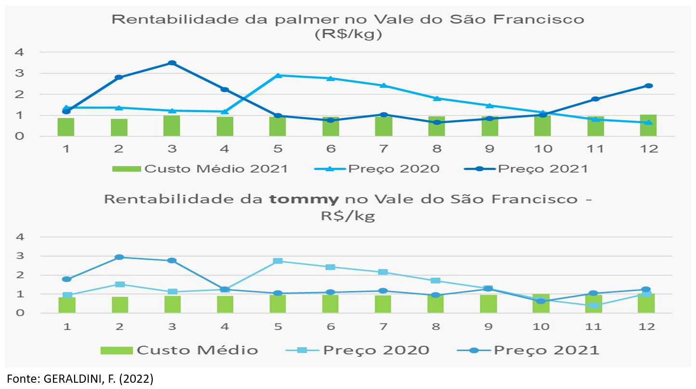

```{r setup, include=FALSE}
knitr::opts_chunk$set(
  echo       = FALSE,
  warning    = FALSE,
  message    = FALSE,
  comment    = NA,
  fig.width  = 9, 
  fig.height = 6,
  fig.align  = "center",
  comment    = "#",
  size       = "normalsize"
  )

library(lubridate)
last <- as.Date("2022-04-22")
today <- as.Date("2022-04-29")
sem_ano <- 17 #ajustar semanalmente
```

<br>

# OBSERVATÓRIO DE MERCADO DE MANGA DA EMBRAPA

<br>


## Coleta e tratamento de informações para o setor produtivo 

<br>

{width=90%}

<br>

## Divulgação das informações geradas para o setor produtivo 

<br>

{width=90%}

<br>

# O MERCADO: OFERTA, DEMANDA E PREÇOS

<br>

## Equilíbrio define os preços

<br>

<center>
{width=55%}
</center>

## As curvas podem se deslocar

<br>

<center>
{width=65%}
</center>

<br>

## O que faz essas curvas se deslocarem?

<br>

Do lado da **Demanda**: Preço do produto, preço dos produtos substitutos, a renda, o gosto/qualidade, por exemplo.

Do lado da **Oferta**: Tecnologia, aumento do capital, mão de obra, terra.

<br>

## A Equação de Lucro

<br>

$$
Lucro = Receita - Despesas
$$
<br>

$$
L = Preço.Quantidade - Custos(Fixos+Variáveis)
$$
<br>
<br>

# A Oferta

<br>

## Perfil dos Produtores

<br>

{width=90%}

<br>

## Principais pólos produtores de Manga

{width=90%}

<br>

## Participação de variedade por pólos produtores de Manga

{width=90%}

<br>

## Evolução da mangicultura de acordo com o IBGE

<br>

```{r manga1, warning=FALSE, message=FALSE, echo=FALSE}
#Direcionado o R para o Diretorio a ser trabalhado
setwd('c:/Users/Joao Ricardo Lima/Dropbox/tempecon/dados_manga')

#Inicio do Script
#Pacotes a serem utilizados
library(mFilter)
library(forecast)
library(tsutils)
library(seasonal)
library(ggplot2)
library(uroot)
library(tseries)
library(ggthemes)
library(dplyr)
library(tidyverse)
library(quantmod)
library(scales)
library(kableExtra)# complex tables
library(lmtest)
library(FinTS)
library(magrittr)# pipe operations
library(readxl)
library(reshape2)
library(plotly)
#library(rmarkdown)
library(bslib)
library(gridExtra)# multiple grid-based plots on a page
library(patchwork)

checkX13()

options(digits=4)
today <- as.Date("2022-02-01")
date <- seq(as.Date('2021-01-01'),to=as.Date('2021-12-01'),by='1 month')
atual <- as.Date("2022-02-01")
mes<-2

#Entrando dados no R
dados <- read_excel("manga_ibge2020.xlsx", col_names = TRUE)
dados$produtividade <- round(dados$produtividade,0)

#Gráfico com Ggplot2 Palmer

mycolor1 <- "gold"
mycolor2 <- "darkgreen"
mycolor3 <- "blue"
mycolor4 <- "red"

g1 <- dados %>% 
  filter(abrangencia=='brasil') %>% 
  ggplot() +  #estetica vai valer para todos os geom's
  geom_col(aes(x=ano, y=area, fill="Area Manga (Hectares)"), lwd=1)+
  scale_fill_manual(values=mycolor1)+
  labs(y= "Hectares", x= "Anos", title='Evolução da Area com Manga no Brasil: 2016-2020',
       caption = "Fonte: IBGE (2022)") +
  scale_y_continuous(limits=c(0, 75000), n.breaks = 10, expand = expansion(add=c(0,0.5)))+
  theme_classic()+ #Definindo tema
  theme(axis.text.x=element_text(angle=0, hjust=0.5, size=12, margin = margin(b=5)),
        axis.text.y=element_text(hjust=1, size=12, margin = margin(l=20)),
        axis.title.x = element_text(size=12, face = "bold", margin = margin(b=0)),
        axis.title.y = element_text(size=12, face = "bold", margin = margin(l=20)),
        plot.title = element_text(hjust = 0.5, size=14),
        plot.caption = element_text(hjust = 0, size=8),
        legend.position = "bottom", legend.title = element_blank(),
        legend.text=element_text(size=12))

ggplotly(g1) %>%
  layout(legend = list(
                      orientation = "h", 
                      x=0.35, 
                      y=-0.3,
                      title=''))


g1a <- dados %>% 
  filter(abrangencia=='vale') %>% 
  ggplot() + #estetica vai valer para todos os geom's
  geom_col(aes(x=ano, y=area, fill="Area Manga (Hectares)"), lwd=1)+
  scale_fill_manual(values=mycolor1)+
  labs(y= "Hectares", x= "Anos", title='Evolução da Area com Manga no Vale do São Francisco: 2016-2020',
       caption = "Fonte: IBGE (2021)") +
  scale_y_continuous(limits=c(0, 30000), n.breaks = 6, expand = expansion(add=c(0,0.5)))+
  theme_classic()+ #Definindo tema
  theme(axis.text.x=element_text(angle=0, hjust=0.5, size=12, margin = margin(b=5)),
        axis.text.y=element_text(hjust=1, size=12, margin = margin(l=20)),
        axis.title.x = element_text(size=12, face = "bold", margin = margin(b=0)),
        axis.title.y = element_text(size=12, face = "bold", margin = margin(l=20)),
        plot.title = element_text(hjust = 0.5, size=14),
        plot.caption = element_text(hjust = 0, size=8),
        legend.position = "bottom", legend.title = element_blank(),
        legend.text=element_text(size=12))

ggplotly(g1a) %>%
  layout(legend = list(
                      orientation = "h", 
                      x=0.35, 
                      y=-0.3,
                      title=''))
```

<br>

## Evolução da produtividade com a manga de acordo com o IBGE


```{r manga2, warning=FALSE, message=FALSE, echo=FALSE}
g3 <- dados %>% 
  filter(abrangencia=='brasil') %>% 
  ggplot() +  #estetica vai valer para todos os geom's
  geom_col(aes(x=ano, y=produtividade, fill="Produtividade (Toneladas/Hectares)"), lwd=1)+
  scale_fill_manual(values=mycolor3)+
  labs(y= "Produtividade (Ton/Ha)", x= "Anos", title='Evolução da Produtividade com Manga no Brasil: 2016-2020',
       caption = "IBGE (2022)") +
  scale_y_continuous(limits=c(0, 25), n.breaks = 5, expand = expansion(add=c(0,0.5)))+
  theme_classic()+ #Definindo tema
  theme(axis.text.x=element_text(angle=0, hjust=0.5, size=12, margin = margin(b=5)),
        axis.text.y=element_text(hjust=1, size=12, margin = margin(l=20)),
        axis.title.x = element_text(size=12, face = "bold", margin = margin(b=0)),
        axis.title.y = element_text(size=12, face = "bold", margin = margin(l=20)),
        plot.title = element_text(hjust = 0.5, size=14),
        plot.caption = element_text(hjust = 0, size=8),
        legend.position = "bottom", legend.title = element_blank(),
        legend.text=element_text(size=12)) # Definindo posição da legenda

ggplotly(g3) %>%
  layout(legend = list(
                      orientation = "h", 
                      x=0.35, 
                      y=-0.3,
                      title=''))

g3a <- dados %>% 
  filter(abrangencia=='vale') %>% 
  ggplot() + #estetica vai valer para todos os geom's
  geom_col(aes(x=ano, y=produtividade, fill="Produtividade (Toneladas/Hectares)"), lwd=1)+
  scale_fill_manual(values=mycolor3)+
  labs(y= "Produtividade (Ton/Ha)", x= "Anos", title='Evolução da Produtividade com Manga no Vale do São Francisco: 2016-2020',
       caption = "IBGE (2021)") +
  scale_y_continuous(limits=c(0, 35), n.breaks = 5, expand = expansion(add=c(0,0.5)))+
  theme_classic()+ #Definindo tema
  theme(axis.text.x=element_text(angle=0, hjust=0.5, size=12, margin = margin(b=5)),
        axis.text.y=element_text(hjust=1, size=12, margin = margin(l=20)),
        axis.title.x = element_text(size=12, face = "bold", margin = margin(b=0)),
        axis.title.y = element_text(size=12, face = "bold", margin = margin(l=20)),
        plot.title = element_text(hjust = 0.5, size=14),
        plot.caption = element_text(hjust = 0, size=8),
        legend.position = "bottom", legend.title = element_blank(),
        legend.text=element_text(size=12)) # Definindo posição da legenda

ggplotly(g3a) %>%
  layout(legend = list(
                      orientation = "h", 
                      x=0.35, 
                      y=-0.3,
                      title=''))
```

<br>

## Evolução do volume com a manga de acordo com o IBGE

```{r manga3, warning=FALSE, message=FALSE, echo=FALSE}
g2 <- dados %>% 
  filter(abrangencia=='brasil') %>% 
  ggplot() +  #estetica vai valer para todos os geom's
  geom_col(aes(x=ano, y=quantidade/1000, fill="Volume (Mil Toneladas)"), lwd=1)+
  scale_fill_manual(values=mycolor2)+
  labs(y= "Mil Toneladas", x= "Anos", title='Evolução do Volume com Manga no Brasil: 2016-2020',
       caption = "Fonte: IBGE (2022)") +
  scale_y_continuous(limits=c(0, 1600), n.breaks = 6, expand = expansion(add=c(0,0.5)))+
  theme_classic()+ #Definindo tema
  theme(axis.text.x=element_text(angle=0, hjust=0.5, size=12, margin = margin(b=5)),
        axis.text.y=element_text(hjust=1, size=12, margin = margin(l=20)),
        axis.title.x = element_text(size=12, face = "bold", margin = margin(b=0)),
        axis.title.y = element_text(size=12, face = "bold", margin = margin(l=20)),
        plot.title = element_text(hjust = 0.5, size=14),
        plot.caption = element_text(hjust = 0, size=8),
        legend.position = "bottom", legend.title = element_blank(),
        legend.text=element_text(size=12)) # Definindo posição da legenda

ggplotly(g2) %>%
  layout(legend = list(
                      orientation = "h", 
                      x=0.35, 
                      y=-0.3,
                      title=''))
```

<br>

## Volume comercializado nos CEASAS

<br>

```{r manga4, warning=FALSE, message=FALSE, echo=FALSE}
#Direcionado o R para o Diretorio a ser trabalhado
setwd('c:/Users/Joao Ricardo Lima/Dropbox/tempecon/dados_manga')

#Inicio do Script
#Pacotes a serem utilizados
library(mFilter)
library(forecast)
library(tsutils)
library(seasonal)
library(ggplot2)
library(uroot)
library(tseries)
library(ggthemes)
library(dplyr)
library(tidyverse)
library(quantmod)
library(scales)
library(kableExtra)# complex tables
library(lmtest)
library(FinTS)
library(magrittr)# pipe operations
library(readxl)
library(reshape2)
library(plotly)
library(DT)

checkX13()

options(digits=4)

#Dados de manga por estados

dados3 <- read_excel("ceasas_mi_total22fev.xlsx", col_names = FALSE)
dados3 <- dados3[,-1]

#Transpor a base de dados
dados3 <- as.data.frame(t(dados3))
colnames(dados3) <-c ('ano','produto','origem','mes','unidade','quilos')
dados3 <- dados3 %>%
  mutate(quilos=as.numeric(quilos))

dados3a <- dados3 %>% filter(ano<2022)
dados3b <- dados3 %>% filter(ano==2022 & mes<=2)
dados3c <- rbind(dados3a, dados3b)

dados3 <- dados3c

#Total de mangas em todos os CEASAS todas as UF

manga_anual_all <- dados3 %>% group_by(ano) %>% summarise(quilos=sum(quilos))
manga_anual_all$todas_UF <- (manga_anual_all$quilos)/1000 #transformando em Toneladas
manga_anual_all <- manga_anual_all[,-2]

#Total de mangas em todos os CEASAS PE + BA

manga_anual_pe <- dados3 %>% filter(origem=='PE') %>% group_by(ano) %>% summarise(quilos=sum(quilos))
manga_anual_ba <- dados3 %>% filter(origem=='BA') %>% group_by(ano) %>% summarise(quilos=sum(quilos))

manga_total_peba <- tibble(manga_anual_pe$quilos + manga_anual_ba$quilos)
manga_total_peba <- manga_total_peba/1000 #passando o volume para toneladas
colnames(manga_total_peba)[1]<-'pe+ba'

#Juntando as bases de dados Total e PEBA
manga_anual_all <- tibble(manga_anual_all, manga_total_peba)
manga_anual_all$ano <- seq(as.Date('2017-01-01'),to=atual,by='1 year')
manga_anual_allm <- melt(manga_anual_all, id.var='ano')

# Variação da oferta

#dados4 <- read_excel("ceasas_mi_peba_mensal22.xlsx", col_names = FALSE)
#dados4 <- dados4[,-1]

#Transpor a base de dados
#dados4 <- as.data.frame(t(dados4))
#colnames(dados4) <-c ('ano','mes','produto','origem','unidade','quilos')
#dados4 <- dados4 %>%
#  mutate(quilos=as.numeric(quilos))

# Geração da variável Tommy
manga_mespe <-  dados3 %>%
  filter(origem == "PE")

manga_mesba <-  dados3 %>%
  filter(origem == "BA")

manga_mespeba <- tibble((manga_mespe$quilos + manga_mesba$quilos)/1000)
manga_mespeba$mes <- seq(as.Date('2017-01-01'),to=today,by='1 month')
manga_mespeba$ano <- manga_mespe$ano
colnames(manga_mespeba)[1] <-'toneladas'

totalpeba_20 <- manga_mespeba %>% filter(ano=='2020')
totalpeba_21 <- manga_mespeba %>% filter(ano=='2021')
totalpeba_22 <- manga_mespeba %>% filter(ano=='2022')

totalpeba_var20 <- as.matrix(totalpeba_20$toneladas)
totalpeba_var21 <- as.matrix(totalpeba_21$toneladas)
totalpeba_var22 <- matrix(NA, nrow=12, ncol=1)
totalpeba_var22a <- as.matrix(totalpeba_22$toneladas)

for(i in 1:mes){
  totalpeba_var22[i,1] = totalpeba_var22a[i,1]
}

variacaopeba_2120 <- ((totalpeba_var21/totalpeba_var20)-1)*100
variacaopeba_2221 <- ((totalpeba_var22/totalpeba_var21)-1)*100

#meses <- seq(1:12)
variacao_totalpeba <- data.frame(date, variacaopeba_2120, variacaopeba_2221)
colnames(variacao_totalpeba) = c('Meses', 'Ano 2021', 'Ano 2022')

variacao_totalpebat <- melt(variacao_totalpeba, id.var='Meses')

#Tendencia PEBA
manga_mespeba2 <- ts(manga_mespeba$toneladas, start = c(2017,1), freq=12)
trend_peba <- cmav(manga_mespeba2, outplot=F)

#Sazonalidade PEBA
decompa_peba<-decompose(manga_mespeba2, type = 'multiplicative')
sazonal_peba <- decompa_peba$figure
meses <- seq(as.Date("2021/1/1"), by = "month", length.out = 12)
sazonalpeba_graph <- tibble(meses, sazonal_peba)


#Comparações com os anos e entre as médias/max/min

peba_2019 <- window(manga_mespeba2, end=c(2019,12))
seaspeba_19<-seasplot(peba_2019, trend=F, outplot = F)
mediaspeba_19 <- colMeans(seaspeba_19$season)

peba_2020 <- window(manga_mespeba2, end=c(2020,12))

peba_2021 <- window(manga_mespeba2, end=c(2021,12))
#seas21<-seasplot(preco_palmer_2021, trend=F, outplot = F)
#medias21 <- colMeans(seas21$season)

peba_22 <- as.matrix(tail(manga_mespeba2,mes)) #ajustar mensalmente
peba_2022 <- matrix(NA, nrow=12, ncol=1)

for(i in 1:mes){
  peba_2022[i,1] = peba_22[i,1]
}

#Como só se tem até a semana 12
mediaspeba_19 <- mediaspeba_19[1:12]

matrixpeba = matrix(NA, nrow=12, ncol=2)

for(i in 1:12){
  matrixpeba[i,1] = min(seaspeba_19$season[,i])
  matrixpeba[i,2] = max(seaspeba_19$season[,i])
}

#time <- c("Janeiro", "Fevereiro", "Março", "Abril", "Maio", "Junho", "Julho", "Agosto", "Setembro", "Outubro", "Novembro", #"Dezembro")
#time <-seq(1:12)
table_peba <- data.frame(meses, matrixpeba[,1], round(mediaspeba_19,1), matrixpeba[,2],
                         round(tail(peba_2020,12),1),
                    round(tail(peba_2021,12),1), peba_2022[,1])
colnames(table_peba) = c('Meses', 'Mínimo', 'Média', 'Máximo', '2020', '2021',
                    '2022')

tablepeba_a <- table_peba[,-c(5:7)]
tablepeba_b <- table_peba[,-c(2,3,4)]

tablepeba_a2 <- melt(tablepeba_a, id.var='Meses')
tablepeba_b2 <- melt(tablepeba_b, id.var='Meses')
mycolors <- c("lightblue3", "gray44", "gold")
mycolor1 <- "gold"
mycolors2 <- c("orange", "lightblue3")

g4 <- ggplot()+
  geom_col(data=manga_anual_allm, aes(x=ano, y=value, fill=variable), lwd=1, position = "dodge")+
  scale_fill_manual(values=mycolors2)+
  scale_y_continuous(limits = c(0, 350000), n.breaks = 10)+
  scale_x_date(date_breaks = "1 year", labels = date_format("%Y"))+
  labs(y= "Toneladas", x= "Anos", title='',
       caption = "Fonte: PROHORT/CONAB reprocessado pelo Observatório de Mercado de Manga da Embrapa")+
  theme_minimal()+
  theme(axis.text.x=element_text(angle=0, hjust=0.5, size=14, margin = margin(b=20)),
        axis.text.y=element_text(hjust=0.5, size=14, margin = margin(l=20)),
        axis.title.y = element_text(size=16, face = "bold"),
        axis.title.x = element_text(size=16, face = "bold"),
        panel.grid.major = element_blank(),
        panel.grid.minor = element_blank(),
        plot.caption = element_text(hjust = 0, size=14),
        legend.position = "bottom", legend.title = element_blank(),
        legend.text=element_text(size=12)) # Definindo posição da legenda

ggplotly(g4) %>%
  layout(legend = list(
                      orientation = "h", 
                      x=0.30, 
                      y=-0.25,
                      title=''))
```

<br>

## Volume Total e Tendência nos CEASAS

<br>

```{r manga5, warning=FALSE, message=FALSE, echo=FALSE}
#Gráfico com Ggplot2 - Tendencia

g5 <- ggplot(data=manga_mespeba, aes(x=mes)) +  #estetica vai valer para todos os geom's
  geom_line(aes(y=toneladas, colour="TONELADAS"), lwd=1)+
  geom_line(aes(y=trend_peba, colour="TENDÊNCIA"), lwd=1)+
  scale_colour_manual("",
                      breaks = c("TONELADAS", "TENDÊNCIA"),
                      values = c("blue", "red")) +
  labs(y= "Quantidade (T)", x= "Meses do Ano", title='',
       caption = "Fonte: CONAB reprocessado pelo Observatório de Mercado de Manga da Embrapa")+
  scale_y_continuous(limits=c(0,25000), n.breaks = 10, expand = expansion(add=c(0,0.5)))+
  scale_x_date(date_breaks = "1 year",
               labels = date_format("%Y"))+
  theme_classic()+ #Definindo tema
  theme(axis.text.x=element_text(angle=35, hjust=0.5, size=14, margin = margin(b=10)),
        axis.text.y=element_text(hjust=1, size=14, margin = margin(l=20)),
        axis.title.x = element_text(size=16, face = "bold", margin = margin(b=0)),
        axis.title.y = element_text(size=16, face = "bold", margin = margin(l=20)),
        plot.title = element_text(hjust = 0.5, size=16, face="italic"),
        plot.caption = element_text(hjust = 0, size=12),
        legend.position = "bottom", legend.title = element_blank(),
        legend.text=element_text(size=12)) # Definindo posição da legenda

ggplotly(g5) %>%
  layout(legend = list(
                      orientation = "h", 
                      x=0.30, 
                      y=-0.25,
                      title=''))
```

<br>

# A Demanda

## Demanda Externa

```{r manga6, warning=FALSE, message=FALSE, echo=FALSE}
#Direcionado o R para o Diretorio a ser trabalhado
setwd('c:/Users/Joao Ricardo Lima/Dropbox/tempecon/dados_manga')

#Inicio do Script
#Pacotes a serem utilizados 
library(mFilter)
library(forecast)
library(tsutils)
library(seasonal)
library(ggplot2)
library(uroot)
library(tseries)
library(ggthemes)
library(dplyr)
library(quantmod)
library(scales)
library(kableExtra)# complex tables
library(lmtest)
library(FinTS)
library(rbcb)
library(magrittr)
library(rmarkdown)
library(reshape2)
library(rbcb)
library(tidyverse)
library(flexdashboard)
library(dygraphs)
library(plotly)
library(DT)
library(lubridate)

checkX13()

options(digits=4)

library(lubridate)
anterior <- as.Date("2022-02-01")
atual <-  as.Date("2022-03-01")
today <- as.Date("2022-04-01")
mes <- 3

#Entrando dados no R
dados1 <- read.csv2('exportacoes_2012_2022.csv', header=T, sep=";", dec = ".")
dados1 <- dados1/1000
dados1[,1] <- seq(2012, 2022, by = 1)
colnames(dados1) = c('Ano', 'Valor', "Toneladas")
dados1 <- tibble(dados1)


#Entrando dados no R
dados2 <- read.csv2('total_exporta_br.csv', header=T, sep=";", dec = ".")
#dados <- dados[,-c(9:10)] #retirar as ultimas colunas
colnames(dados2)[1]<-'ano'

#Entrando dados no R
dados3 <- read.csv2('destinos_2022.csv', header=T, sep=";", dec = ".")
colnames(dados3)[1]<-'Paises'

#Entrando dados no R
dados4 <- read.csv2('via_2022.csv', header=T, sep=";", dec = ".")
colnames(dados4)[1]<-'Vias'

#Entrando dados no R
dados5 <- read.csv2('uf_2022.csv', header=T, sep=";" , dec = ".")
colnames(dados5)[1]<-'UF'

#Ajusta para Valor
#Analise de Serie Temporal
exporta_manga_valor <- dados2[,3]
exporta_manga_valor<-exporta_manga_valor/1000000
exporta_manga_valor <- ts(exporta_manga_valor, start=c(2012,1), freq=12)

#Tendencia
trend_valor <- cmav(exporta_manga_valor, outplot=F)
date <- seq(as.Date('2012-01-01'),to=atual,by='1 month') 
trend_valor <- tibble(date, trend_valor)

#Sazonalidade
decompa<-decompose(exporta_manga_valor, type = 'multiplicative')
sazonal_valor <- decompa$figure
#meses <- seq(1:12)
meses <- seq(as.Date("2021/1/1"), by = "month", length.out = 12) 
sazonal_graph <- tibble(meses, sazonal_valor)

#Comparações com os anos e entre as médias/max/min

exporta_manga_valor_2019 <- window(exporta_manga_valor, end=c(2019,12))
seas19<-seasplot(exporta_manga_valor_2019, trend=F, outplot = F)
medias19 <- colMeans(seas19$season)

exporta_manga_valor_2020 <- window(exporta_manga_valor, end=c(2020,12))

exporta_manga_valor_2021 <- window(exporta_manga_valor, end=c(2021,12))
#seas21<-seasplot(preco_palmer_2021, trend=F, outplot = F)
#medias21 <- colMeans(seas21$season)

exporta_manga_valor_22 <- as.matrix(tail(exporta_manga_valor,mes)) 

exporta_manga_valor_2022 <- matrix(NA, nrow=12, ncol=1)

for(i in 1:mes){
  exporta_manga_valor_2022[i,1] = exporta_manga_valor_22[i,1]
}
  
#Como só se tem até a semana 12
medias19 <- medias19[1:12]

matrix = matrix(NA, nrow=12, ncol=2)

for(i in 1:12){
  matrix[i,1] = min(seas19$season[,i])
  matrix[i,2] = max(seas19$season[,i])
}

#time <- c("Janeiro", "Fevereiro", "Março", "Abril", "Maio", "Junho", "Julho", "Agosto", "Setembro", "Outubro", "Novembro", #"Dezembro")
#time <-seq(1:12)
table <- data.frame(meses, matrix[,1], round(medias19,3), matrix[,2], round(tail(exporta_manga_valor_2020,12),3),
                    round(tail(exporta_manga_valor_2021,12),3), exporta_manga_valor_2022[,1])
colnames(table) = c('Meses', 'Mínimo', 'Média', 'Máximo', '2020', '2021', 
                    '2022')

tablea <- table[,-c(5:7)]
tableb <- table[,-c(2,3,4)]

tablea2 <- melt(tablea, id.var='Meses')
tableb2 <- melt(tableb, id.var='Meses')
mycolors <- c("lightblue3", "gray44", "gold")

#Ajusta para Volume
#Analise de Serie Temporal
exporta_manga_volume <- dados2[,4]
exporta_manga_volume<-exporta_manga_volume/1000  #passando de quilo para tonelada

#Ajuste para a variação Mensal do Volume

variacao_volume_20 <-  dados2 %>% filter(ano=='2020')
variacao_volume_21 <-  dados2 %>% filter(ano=='2021')
variacao_volume_22 <-  dados2 %>% filter(ano=='2022')

variacao_volume_20 <-  variacao_volume_20[,4]/1000
variacao_volume_21 <-  variacao_volume_21[,4]/1000
variacao_volume_22 <-  variacao_volume_22[,4]/1000

#Setando como uma série temporal
exporta_manga_volume <- ts(exporta_manga_volume, start=c(2012,1), freq=12)

#Tendencia
trend_volume <- cmav(exporta_manga_volume, outplot=F)
trend_volume <- tibble(date, trend_volume)

#Sazonalidade
decompa<-decompose(exporta_manga_volume, type = 'multiplicative')
sazonal_volume <- decompa$figure
sazonal_graph_volume <- tibble(meses, sazonal_volume)

#Comparações com os anos e entre as médias/max/min

exporta_manga_volume_2019 <- window(exporta_manga_volume, end=c(2019,12))
seas19_vol<-seasplot(exporta_manga_volume_2019, trend=F, outplot = F)
medias19_vol <- colMeans(seas19_vol$season)

exporta_manga_volume_2020 <- window(exporta_manga_volume, end=c(2020,12))

exporta_manga_volume_2021 <- window(exporta_manga_volume, end=c(2021,12))

exporta_manga_volume_22 <- as.matrix(tail(exporta_manga_volume,mes)) 

exporta_manga_volume_2022 <- matrix(NA, nrow=12, ncol=1)

for(i in 1:mes){
  exporta_manga_volume_2022[i,1] = exporta_manga_volume_22[i,1]
}
  
#Como só se tem até a semana 12
medias19_vol <- medias19_vol[1:12]

matrix_vol = matrix(NA, nrow=12, ncol=2)

for(i in 1:12){
  matrix_vol[i,1] = min(seas19_vol$season[,i])
  matrix_vol[i,2] = max(seas19_vol$season[,i])
}

#time <- c("Janeiro", "Fevereiro", "Março", "Abril", "Maio", "Junho", "Julho", "Agosto", "Setembro", "Outubro", "Novembro", #"Dezembro")
#time <-seq(1:12)
table_volume <- data.frame(meses, round(matrix_vol[,1],0), round(medias19_vol,0), round(matrix_vol[,2],0), round(tail(exporta_manga_volume_2020,12),0),
round(tail(exporta_manga_volume_2021,12),0), round(exporta_manga_volume_2022[,1],0))
colnames(table_volume) = c('Meses', 'Mínimo', 'Média', 'Máximo', '2020', '2021', 
                    '2022')

tablea_vol <- table_volume[,-c(5:7)]
tableb_vol <- table_volume[,-c(2,3,4)]

tablea2_vol <- melt(tablea_vol, id.var='Meses')
tableb2_vol <- melt(tableb_vol, id.var='Meses')


#Variação Mensal 2021

variacao_volume_2020 <- as.matrix(variacao_volume_20)
variacao_volume_2021 <- as.matrix(variacao_volume_21)
variacao_volume_2022 <- matrix(NA, nrow=12, ncol=1)
variacao_volume_22 <- as.matrix(variacao_volume_22)

for(i in 1:mes){
  variacao_volume_2022[i,1] = variacao_volume_22[i,1]
}

variacao_21 <- ((variacao_volume_2021/variacao_volume_2020) - 1)*100
variacao_22 <- ((variacao_volume_2022/variacao_volume_2021) - 1)*100

variacao <- data.frame(meses, variacao_21, variacao_22)
colnames(variacao) = c('Meses', 'Variação 2021 e 2020', 'Variação 2022 e 2021')

variacaom <- melt(variacao, id.var='Meses')

mycolors2 <- c("orange", "lightblue3")

#Cambio

#dados6 <- get_market_expectations("monthly", "Câmbio", start_date = "2022-01-01")
#dados6 <- dados6 %>% filter (baseCalculo == 0) 
#dates <- dados6$Data[dados6$DataReferencia=='12/2022']
#cambio_esperado <- dados6$Media[dados6$DataReferencia=='12/2022']
#cambio_esperado <- round(cambio_esperado,2)
#dados6 <- data.frame(dates=dates, cambio=cambio_esperado)
```

```{r manga7, warning=FALSE, message=FALSE, echo=FALSE}
#Gráfico com Ggplot2

mycolor1 <- "gold"
mycolor2 <- "red"

g1 <- ggplot(data=dados1) +  #estetica vai valer para todos os geom's
  geom_col(aes(x=Ano, y=Toneladas, fill="Mil Toneladas"), lwd=1)+
    scale_fill_manual(values=mycolor1)+
  geom_line(aes(x=Ano, y=Valor, colour="Milhões de Dólares"), size=2)+
  scale_colour_manual(values=mycolor2)+
  labs(y= "US$ Milhões / Mil Ton", x= "Anos", title='Receita de Exportação e Volume Exportado de Manga (Brasil): 2012 a 2022',
       caption = "") +
  scale_y_continuous(limits=c(0, 300), n.breaks = 10, expand = expansion(add=c(0,0.5)))+
  scale_x_continuous(breaks = seq(2012, 2022, by = 1))+
  theme_classic()+ #Definindo tema
  theme(axis.text.x=element_text(angle=0, hjust=0.5, size=8, margin = margin(b=10)),
        axis.text.y=element_text(hjust=1, size=8, margin = margin(l=20)),
        axis.title.x = element_text(size=8, face = "bold", margin = margin(b=10)),
        axis.title.y = element_text(size=8, face = "bold", margin = margin(l=20)),
        plot.title = element_text(hjust = 0.5, size=12),
        plot.caption = element_text(hjust = 0, size=12),
        legend.position = "bottom", legend.title = element_blank(),
        legend.text=element_text(size=9)) # Definindo posição da legenda

ggplotly(g1) %>%
  layout(legend = list(
                      orientation = "h", 
                      x=0.25, 
                      y=-0.2,
                      title=''))
```

<br>

# Consumo de Manga de acordo com a Pesquisa de Orçamento Familiar do IBGE (quilo por domicílio)

<br>

```{r manga8, warning=FALSE, message=FALSE, echo=FALSE}
#Direcionado o R para o Diretorio a ser trabalhado
setwd('c:/Users/Joao Ricardo Lima/Dropbox/tempecon/dados_manga')

#Inicio do Script
#Pacotes a serem utilizados
library(magrittr)# pipe operations
library(readxl)
library(DT)

#Dados de manga por estados

dados1 <- read_excel("pof_consumo_manga.xlsx", col_names = TRUE)

datatable(dados1, option = list(
  autoWidth = TRUE,
  columnDefs = list(list(className = 'dt-center', targets = "_all"))))

```
Fonte: POF/IBGE (2022)

<br>

# O COMPORTAMENTO DOS PREÇOS DE MANGA

## Manga Palmer ao produtor do Vale do São Francisco

<br>

```{r manga9, warning=FALSE, message=FALSE, echo=FALSE}
#Direcionado o R para o Diretorio a ser trabalhado
setwd('c:/Users/Joao Ricardo Lima/Dropbox/tempecon/dados_manga')

library(lubridate)
last <- as.Date("2022-04-22")
today <- as.Date("2022-04-29")
sem_ano <- 17 #ajustar semanalmente
data <- as.Date("2022-04-29") #ajustar semanalmente

#Entrando dados no R
dados <- read.csv2('dados_manga_palmer_semana.csv', header=T, sep=";", dec=".")
#dados <- dados[,-c(9:10)] #retirar as ultimas colunas
colnames(dados)[1]<-'produto'

#Entrando dados no R - Deflator
igpdi <- read.csv2('igpdi.csv', 
                   header=T, sep=";",
                   dec=".")

dados_comb<-cbind(dados, igpdi)

teste<-dados_comb[,4]-dados_comb[,7]

dadosp<-dados_comb[,-c(1,2,6,7)]

#Deflacionar a serie de manga
dadosp$preco_def <- dadosp[,3]*(tail(dadosp[,4],1)/dadosp[,4])
#dadosp<-dadosp[,-2]

#Criando uma variável com as datas semanais
dadosp$date <- seq(as.Date('2012-01-14'),to=data, by='1 week') 
dadosp$date[dadosp$date == "2016-01-02"] <- "2015-12-31" #ajustando algumas datas
dadosp$date[dadosp$date == "2015-01-03"] <- "2014-12-31"
dadosp$date[dadosp$date == "2014-01-04"] <- "2013-12-31"
dadosp$date[dadosp$date == "2013-01-05"] <- "2012-12-31"

#Analise de Serie Temporal
preco_palmer <- dadosp[,5]
preco_palmer <- ts(preco_palmer, start=c(2012,1), freq=52)
#preco_palmer <- window(preco_palmer, end=c(2021,52))

# Parte 2
#Decompor a série
decompa<-decompose(preco_palmer, type = 'multiplicative')

#Tendecia
trend_palmer <- cmav(preco_palmer, outplot=F)

#Sazonalidade
sazonalidade <- decompa$figure
semanas <- seq(1:52)
sazonal_graph <- tibble(cbind(semanas, sazonalidade))

#Parte 3
#Analise das comparações entre as médias
preco_palmer_2019 <- window(preco_palmer, end=c(2019,52))
seas19<-seasplot(preco_palmer_2019, trend=F, outplot = F)
medias19 <- colMeans(seas19$season)

preco_palmer_2020 <- window(preco_palmer, end=c(2020,52))

preco_palmer_2021 <- window(preco_palmer, end=c(2021,52))
#seas21<-seasplot(preco_palmer_2021, trend=F, outplot = F)
#medias21 <- colMeans(seas21$season)

preco_palmer_22 <- as.matrix(tail(dadosp$preco_def,sem_ano))  
preco_palmer_2022 <- matrix(NA, nrow=52, ncol=1)

for(i in 1:sem_ano){                                          
  preco_palmer_2022[i,1] = preco_palmer_22[i,1]
}
  

#Como só se tem até a semana 52
medias19 <- medias19[1:52]
#medias21 <- medias21[1:52]

matrix = matrix(NA, nrow=52, ncol=2)

for(i in 1:52){
  matrix[i,1] = min(seas19$season[,i])
  matrix[i,2] = max(seas19$season[,i])
}

time <- seq(1:52)
table <- data.frame(time, matrix[,1], round(medias19,2), matrix[,2], round(tail(preco_palmer_2020,52),2),
                    round(tail(preco_palmer_2021,52),2), preco_palmer_2022[,1])
colnames(table) = c('Semanas', 'Mínimo', 'Média', 'Máximo', '2020', '2021', 
                    '2022')
tablea <- table[,-c(5:7)]
tableb <- table[,-c(2,3,4)]

tablea2 <- melt(tablea, id.var='Semanas')
tableb2 <- melt(tableb, id.var='Semanas')
mycolors <- c("lightblue3", "gray44", "gold")

table_db <- data.frame(matrix[,1], round(medias19,2), matrix[,2], round(tail(preco_palmer_2020,52),2),
                    round(tail(preco_palmer_2021,52),2), preco_palmer_2022[,1])
colnames(table_db) = c('Mínimo', 'Média', 'Máximo', '2020', '2021', '2022')

g1 <- ggplot(data=dadosp, aes(x=date)) +  #estetica vai valer para todos os geom's
  geom_line(aes(y=preco_def, colour="PREÇO"), lwd=1)+
  geom_line(aes(y=trend_palmer, colour="TENDÊNCIA"), lwd=1)+
  scale_colour_manual("", 
                      breaks = c("PREÇO", "TENDÊNCIA"),
                      values = c("blue", "red")) +
  labs(y= "Preço R$", x= "Semanas de cada Ano", title='Evolução dos preços e da tendência de manga Palmer ao produtor',
       caption = "Fonte: CEPEA reprocessado pelo Observatório de Mercado de Manga da Embrapa") +
  scale_y_continuous(limits=c(0,8), n.breaks = 9, expand = expansion(add=c(0,0.5)), 
                     labels=number_format(accuracy = 0.01, decimal.mark = ","))+
  scale_x_date(date_breaks = "1 year",
               labels = date_format("%Y"))+
  theme_classic()+ #Definindo tema
  theme(axis.text.x=element_text(angle=35, hjust=1, size=10, margin = margin(b=20)),
        axis.text.y=element_text(hjust=1, size=10, margin = margin(l=20)),
        axis.title.x = element_text(size=10, face = "bold", margin = margin(b=20)),
        axis.title.y = element_text(size=10, face = "bold", margin = margin(l=20)),
        plot.title = element_text(hjust = 0.5, size=16, face="italic"),
        plot.caption = element_text(hjust = 0, size=12),
        legend.position = c(1,1),
        legend.justification = c(1.2, 1.2),
        legend.text=element_text(size=10)) # Definindo posição da legenda

ggplotly(g1) %>%
  layout(legend = list(
                      orientation = "h", 
                      x=0.35, 
                      y=-0.2,
                      title=''))


g1a <- ggplot()+
  geom_col(data=tableb2, aes(x=Semanas, y=value, fill=variable), size=2, width = 0.7,
           position = "dodge")+
  scale_fill_manual(values=mycolors)+
    geom_line(data=tablea2, aes(x=Semanas, y=value, colour=variable), linetype = "solid",
            size = 1)+
  scale_colour_manual(values = c("red", "chocolate", "darkgreen")) +
  scale_y_continuous(limits = c(0, 8), n.breaks = 8, labels = number_format(accuracy = 0.01,
                                                       decimal.mark = ","))+
  scale_x_continuous(breaks = seq(1, 52, by = 1))+
  labs(y= "Preço R$", x= "Semanas de cada Ano", title='Mínimo, Máximo, Média e preços de 2020 a 2022 de Manga Palmer ao produtor',
       caption = "Fonte: CEPEA reprocessado pelo Observatório de Mercado de Manga da Embrapa")+
  theme_minimal()+
  theme(axis.text.x=element_text(angle=0, hjust=0.5, size=8, margin = margin(b=10)),
        axis.text.y=element_text(hjust=0.5, size=8, margin = margin(l=10)),
        axis.title.y = element_text(size=8, face = "bold"),
        axis.title.x = element_text(size=8, face = "bold"),
        panel.grid.major = element_blank(),
        panel.grid.minor = element_blank(),
        plot.caption = element_text(hjust = 0, size=8),
        plot.title = element_text(hjust = 0.5, size=12, face=""),
        legend.position = "right", legend.title = element_blank(),
        legend.text=element_text(size=8)) # Definindo posição da legenda

ggplotly(g1a) %>%
  layout(legend = list(
                      orientation = "h", 
                      x=0, 
                      y=-0.2,
                      title=''))
```
Fonte: CEPEA reprocessado pelo Observatório de Mercado de Manga da Embrapa
<br>

## Manga Tommy ao produtor do Vale do São Francisco

<br>

```{r manga10, warning=FALSE, message=FALSE, echo=FALSE}
#Direcionado o R para o Diretorio a ser trabalhado
setwd('c:/Users/Joao Ricardo Lima/Dropbox/tempecon/dados_manga')

#Entrando dados no R
dados <- read.csv2('dados_manga_tommy_semana.csv', header=T, sep=";", dec=".")
#dados <- dados[,-c(9:10)] #retirar as ultimas colunas
colnames(dados)[1]<-'produto'

#Entrando dados no R - Deflator
igpdi <- read.csv2('igpdi.csv', 
                   header=T, sep=";",
                   dec=".")

dados_comb<-cbind(dados, igpdi)

teste<-dados_comb[,4]-dados_comb[,7]

dadosp<-dados_comb[,-c(1,2,6,7)]

#Deflacionar a serie de manga
dadosp$preco_def <- dadosp[,3]*(tail(dadosp[,4],1)/dadosp[,4])
#dadosp<-dadosp[,-2]

#Criando uma variável com as datas semanais
dadosp$date <- seq(as.Date('2012-01-14'),to=today,by='1 week') 
dadosp$date[dadosp$date == "2016-01-02"] <- "2015-12-31" #ajustando algumas datas
dadosp$date[dadosp$date == "2015-01-03"] <- "2014-12-31"
dadosp$date[dadosp$date == "2014-01-04"] <- "2013-12-31"
dadosp$date[dadosp$date == "2013-01-05"] <- "2012-12-31"

#Analise de Serie Temporal
preco_tommy <- dadosp[,5]
preco_tommy <- ts(preco_tommy, start=c(2012,1), freq=52)
#preco_tommy <- window(preco_tommy, end=c(2021,52))

trend_tommy <- cmav(preco_tommy, outplot=F)

decompa<-decompose(preco_tommy, type = 'multiplicative')

sazonalidade <- decompa$figure
semanas <- seq(1:52)
sazonal_graph <- tibble(cbind(semanas, sazonalidade))

#Analise das comparações entre as médias
preco_tommy_2019 <- window(preco_tommy, end=c(2019,52))
seas19<-seasplot(preco_tommy_2019, trend=F, outplot = F)
medias19 <- colMeans(seas19$season)

preco_tommy_2020 <- window(preco_tommy, end=c(2020,52))

preco_tommy_2021 <- window(preco_tommy, end=c(2021,52))
#seas21<-seasplot(preco_tommy_2021, trend=F, outplot = F)
#medias21 <- colMeans(seas21$season)

preco_tommy_22 <- as.matrix(tail(dadosp$preco_def,sem_ano)) 
preco_tommy_2022 <- matrix(NA, nrow=52, ncol=1)

for(i in 1:sem_ano){
  preco_tommy_2022[i,1] = preco_tommy_22[i,1]
}

#Como só se tem até a semana 52
medias19 <- medias19[1:52]
#medias21 <- medias21[1:52]

matrix = matrix(NA, nrow=52, ncol=2)

for(i in 1:52){
  matrix[i,1] = min(seas19$season[,i])
  matrix[i,2] = max(seas19$season[,i])
}

time <- seq(1:52)
table <- data.frame(time, matrix[,1], round(medias19,2), matrix[,2], round(tail(preco_tommy_2020,52),2),
                    round(tail(preco_tommy_2021,52),2), preco_tommy_2022[,1])
colnames(table) = c('Semanas', 'Mínimo', 'Média', 'Máximo', 'Ano 2020', 'Ano 2021', 
                    'Ano 2022')

tablea <- table[,-c(5:7)]
tableb <- table[,-c(2,3,4)]

tablea2 <- melt(tablea, id.var='Semanas')
tableb2 <- melt(tableb, id.var='Semanas')
mycolors <- c("lightblue3", "gray44", "gold")

g5 <- ggplot(data=dadosp, aes(x=date)) +  #estetica vai valer para todos os geom's
  geom_line(aes(y=preco_def, colour="PREÇO"), lwd=1)+
  geom_line(aes(y=trend_tommy, colour="TENDÊNCIA"), lwd=1)+
  scale_colour_manual("", 
                      breaks = c("PREÇO", "TENDÊNCIA"),
                      values = c("blue", "red")) +
  labs(y= "Preço R$", x= "Semanas de cada Ano", title='Evolução dos preços e da tendência de manga Tommy ao produtor',
       caption = "Fonte: CEPEA reprocessado pelo Observatório de Mercado de Manga da Embrapa") +
  scale_y_continuous(limits=c(0,8), n.breaks = 9, expand = expansion(add=c(0,0.5)), 
                     labels=number_format(accuracy = 0.01, decimal.mark = ","))+
  scale_x_date(date_breaks = "1 year",
               labels = date_format("%Y"))+
  theme_classic()+ #Definindo tema
theme(axis.text.x=element_text(angle=35, hjust=1, size=10, margin = margin(b=20)),
        axis.text.y=element_text(hjust=1, size=10, margin = margin(l=20)),
        axis.title.x = element_text(size=10, face = "bold", margin = margin(b=20)),
        axis.title.y = element_text(size=10, face = "bold"),
        plot.title = element_text(hjust = 0.5, size=16, face="italic"),
        plot.caption = element_text(hjust = 0, size=12),
        legend.position = c(1,1),
        legend.justification = c(1.2, 1.2),
        legend.text=element_text(size=10)) # Definindo posição da legenda

ggplotly(g5) %>%
  layout(legend = list(
                      orientation = "h", 
                      x=0.35, 
                      y=-0.2,
                      title=''))

g7 <- ggplot()+
  geom_col(data=tableb2, aes(x=Semanas, y=value, fill=variable), size=2, width = 0.7,
           position = "dodge")+
  scale_fill_manual(values=mycolors)+
  geom_line(data=tablea2, aes(x=Semanas, y=value, colour=variable), linetype = "solid",
            size = 1)+
  scale_colour_manual(values = c("red", "chocolate", "darkgreen")) +
  scale_y_continuous(limits = c(0, 8), n.breaks = 8, labels = number_format(accuracy = 0.01,
                                                                            decimal.mark = ","))+
  scale_x_continuous(breaks = seq(1, 52, by = 3))+
  labs(y= "Preço R$", x= "Semanas de cada Ano", title='Mínimo, Máximo, Média e preços de 2020 a 2022 de Manga Tommy ao produtor',
       caption = "Fonte: CEPEA reprocessado pelo Observatório de Mercado de Manga da Embrapa")+
  theme_minimal()+
  theme(axis.text.x=element_text(angle=0, hjust=0.5, size=10, margin = margin(b=20)),
        axis.text.y=element_text(hjust=0.5, size=10, margin = margin(l=20)),
        axis.title.y = element_text(size=10, face = "bold"),
        axis.title.x = element_text(size=10, face = "bold"),
        panel.grid.major = element_blank(),
        panel.grid.minor = element_blank(),
        plot.caption = element_text(hjust = 0, size=14),
        legend.position = "bottom", legend.title = element_blank(),
        legend.text=element_text(size=10)) # Definindo posição da legenda

ggplotly(g7) %>%
  layout(legend = list(
                      orientation = "h", 
                      x=0, 
                      y=-0.2,
                      title=''))

```
Fonte: CEPEA reprocessado pelo Observatório de Mercado de Manga da Embrapa

<br>

# CUSTOS COM INSUMOS E FRETE

<br>

<center>
{width=90%}
</center>

<br>

<center>
{width=90%}
</center>

<br>

# RENTABILIDADE

<br>

<center>
{width=90%}
</center>

<br>

# DESAFIOS

<br>

1) REDUÇÃO DE **CUSTOS**

2) REDUÇÃO DE OFERTA DE MANGA COM **BAIXA QUALIDADE** (ARRASTÃO, REFUGO)

3) AUMENTAR A **DEMANDA**

4) **PROFISSIONALIZAÇÃO** DOS PRODUTORES (EMPRESÁRIOS RURAIS)

5) **GESTÃO** DO NEGÓCIO, TODO CENTAVO É RELEVANTE

6) **UNIÃO**, FORMAR **COOPERATIVAS**

7) **AGREGAR VALOR** AS MANGAS

<br>

# INFORMAÇÕES

<br>
<br>

<center>{width=16cm}</center>

<br>
<br>

<center> João Ricardo F. de Lima </center>
<center> Email: joao.ricardo@embrapa.br </center>

<br>

<center> [https://www.embrapa.br/observatorio-da-manga](https://www.embrapa.br/observatorio-da-manga) </center>

<br>

<center> Telefones: </center>
<center> 87-3866-3667 </center> 
<center> 87-99961-5799 </center>

<br>

<center>{width=6cm}</center>

<br>
<br>


